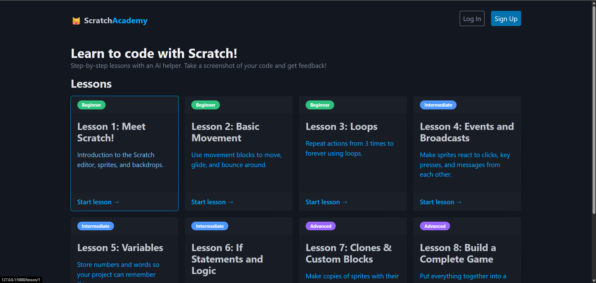
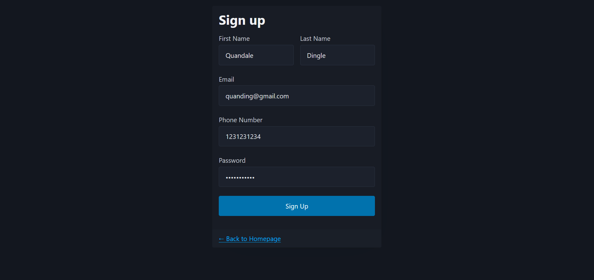
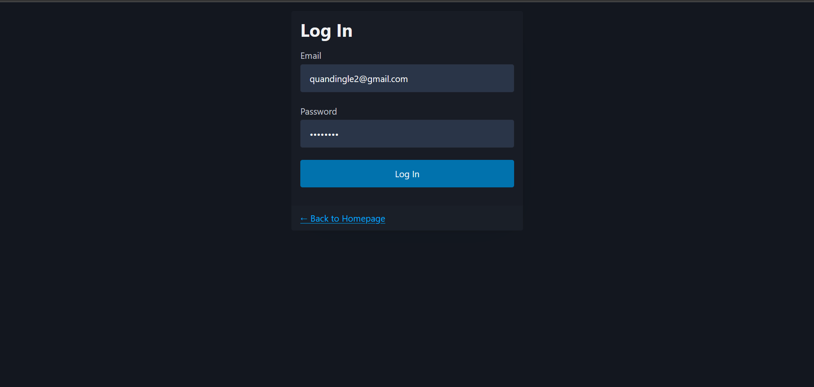
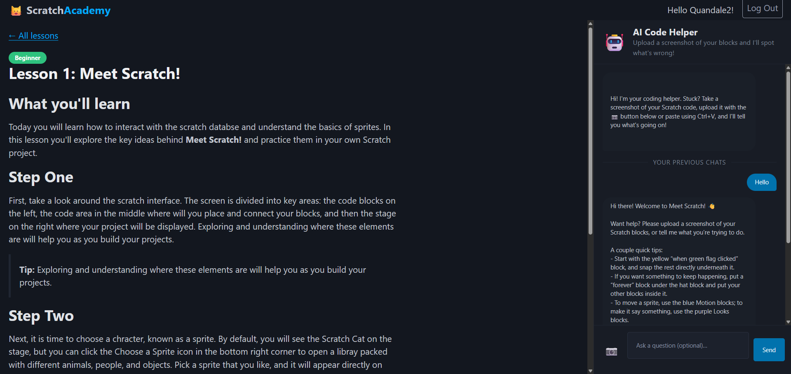
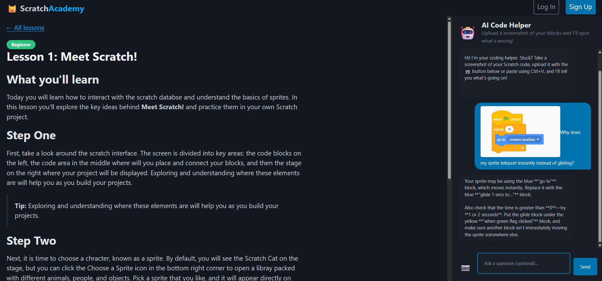

# Project: Scratch Academy

Scratch Academy aims to teach young kids interested in S.T.E.M. how to code using Scratch. Scratch is a great starting point for anyone getting into programming. To encourage learning, our platform features 8 different lessons and an AI agent designed to help students master Scratch and fundamental programming concepts.

## Getting Started

Follow these instructions to get a copy of the project up and running on your local machine for development and testing purposes. Also open Scratch.mit.edu in a new tab and follow along

### Prerequisites

The project requires Python 3 and the following external packages:
* Flask
* openai
* python-dotenv

*Note: Built-in Python modules used include `base64`, `json`, `sqlite3`, and `os`.*

### Installation & Setup

1. **Clone or navigate to the project directory:**
   ```bash
   cd /path/to/SCRATCHWEBSITE
   ```

2. **Create a virtual environment:**
   ```bash
   python -m venv venv
   ```
   *(Try `python3` if `python` does not work on your system)*

3. **Activate the virtual environment:**
   * **Windows (PowerShell):** `.\venv\Scripts\Activate.ps1`
   * **Windows (CMD):** `venv\Scripts\activate.bat`
   * **Mac / Linux:** `source venv/bin/activate`

4. **Install the external packages:**
   ```bash
   pip install -r requirements.txt
   ```

5. **Run the application:**
   ```bash
   python app.py
   ```

## How to Use

1. Open your browser and navigate to the local host URL provided by Flask (usually `http://127.0.0.1:5000`).
2. Sign up or log in using the buttons on the top right.
3. Click on **Lesson 1** (our sample lesson for testing).
4. Interact with the AI agent by asking questions or uploading screenshots of your Scratch code as you follow the lesson plan.

## Usage Examples







## Authors

**Roger Chao and Aahan Kumar**


## Acknowledgments

* Built using the OpenAI API for the interactive AI tutoring agent.
